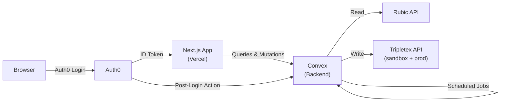

# Architecture

## Overview

Rubic2Tripletex is a multi-tenant SaaS integration platform: **Rubic → Tripletex**. It runs as a Next.js app with [Convex](https://convex.dev) as the serverless backend (database, functions, scheduling) and [Auth0](https://auth0.com) for authentication.



## Source of Truth Boundaries

| Domain | Owner | Details |
| --- | --- | --- |
| **Authentication** | Auth0 | Credentials, SSO/MFA, login/logout, ID tokens |
| **Identity facts** | Auth0 (read-only) | `sub`, `email`, `name`, `picture` — synced to Convex on login |
| **Organizations** | Convex | Name, slug, settings, creation, deletion; Auth0 Organization auto-created via M2M |
| **Role assignments** | Convex | Convex `memberships.role` is the source of truth; synced to Auth0 Organization Roles via M2M (best-effort) |
| **Memberships** | Convex | Convex `memberships` table is the source of truth; synced to Auth0 Organization membership via M2M (best-effort) |
| **Invitations** | Convex + Auth0 | Convex is source of truth for which invitations are sent (email, role, org). Auth0 sends the invitation email and generates the invite link. Auth0 is the authority for acceptance (user clicks link, signs in, is added to org). Convex syncs acceptance from Auth0 on login via Post-Login Action. Revoking in Convex also revokes in Auth0. |
| **User app data** | Convex | Preferences, `lastActiveAt`, feature flags, audit trails |
| **Business data** | Convex | API credentials, sync state, mappings, schedules |

**Rule:** Convex owns all organization, membership, and role data. Changes are written to Convex first, then synced to Auth0 via M2M (best-effort). Auth0 failures never block Convex operations. Auth0 roles are auto-created on demand and their IDs are cached in the `auth0RoleMappings` table.

## Roles

Five roles are defined in Convex and assigned per-organization via the `memberships` table. Auth0 roles are auto-created via M2M on first use and their IDs are cached in the `auth0RoleMappings` table:

| Role | Purpose | Key permissions |
| --- | --- | --- |
| **owner** | Organization creator | Everything including org deletion, billing, member management |
| **admin** | Administrator | Manage members, invitations, API credentials, org settings |
| **member** | Day-to-day operator | Trigger syncs, manage schedules and mappings, view data |
| **billing** | Billing manager | Manage billing/subscriptions (future), view dashboard |
| **viewer** | Read-only stakeholder | View dashboard, sync history, mappings — no write access |

**Permission hierarchy:** owner > admin > member > billing/viewer (billing and viewer are lateral scopes).

Auth helpers in `convex/lib/auth.ts`:
- `requireOrgMembership()` — any role (read access)
- `requireOrgOperator()` — member, admin, owner (write/sync operations)
- `requireOrgAdmin()` — admin, owner (member management, credentials, settings)
- `requireOrgBilling()` — billing, admin, owner (billing operations)

## Authentication Flow

```
1. User visits app
2. Auth0 login (redirect or universal login)
3. Auth0 Post-Login Action fires → calls Convex HTTP Action to upsert user record
4. Auth0 returns ID token to client
5. ConvexProviderWithAuth fetches token via /api/convex-token
6. Convex verifies JWT against Auth0 issuer (convex/auth.config.ts)
7. useStoreUserEffect calls api.users.store (idempotent JIT provisioning)
8. App loads with authenticated Convex context
```

See [Auth0 Post-Login Action Guide](./auth0-post-login-action.md) for server-side provisioning setup.

## Data Access Layer (DAL)

All Convex functions enforce authorization through a layered approach:

1. **`authenticatedQuery` / `authenticatedMutation`** (from `convex/functions.ts` via `convex-helpers`)
   - Verifies the caller has a valid JWT
   - Looks up the Convex `users` record by `tokenIdentifier`
   - Injects `ctx.user` and `ctx.identity` into every handler
   - Throws if unauthenticated or user record missing

2. **`requireOrgMembership(ctx, orgId)`** (from `convex/lib/auth.ts`)
   - Checks the `memberships` table for the caller + org
   - Any role passes (including viewer and billing) — used for read operations
   - Returns `{ identity, user, membership }` on success

3. **`requireOrgOperator(ctx, orgId)`** (from `convex/lib/auth.ts`)
   - Requires member, admin, or owner role
   - Blocks viewer and billing from write/sync operations

4. **`requireOrgAdmin(ctx, orgId)`** (from `convex/lib/auth.ts`)
   - Requires admin or owner role
   - Used for member management, API credentials, org settings

5. **`requireOrgBilling(ctx, orgId)`** (from `convex/lib/auth.ts`)
   - Requires billing, admin, or owner role
   - Used for billing operations (future)

Every business-data function uses these guards. There is no unauthenticated access to tenant data. Read operations use `requireOrgMembership`, write operations use `requireOrgOperator` or `requireOrgAdmin` depending on sensitivity.

## Multi-Tenancy Model

```
organizations
    ├── memberships (userId + role)
    ├── apiCredentials (per provider, per environment)
    ├── integrationSchedules (cron-based)
    ├── syncState (run history)
    ├── customerMapping
    ├── productMapping
    ├── invoiceMapping
    └── departmentMapping
```

Each tenant's data is scoped by `organizationId`. All queries filter by the selected org, and authorization is checked on every request.

## Sync Flow

Each sync type follows the same pattern, executed as Convex actions:

1. Load API credentials for the org + provider + environment from Convex
2. Fetch entities from Rubic API (paginated)
3. Map to Tripletex format (using mappers in `src/mappers/`)
4. Compare against stored hashes/mappings to detect changes
5. Create or update in Tripletex
6. Record mapping and sync state in Convex

Both sandbox and production Tripletex environments run independently with separate credentials, mappings, and sync state per organization.

## Convex Schema

Key tables (see `convex/schema.ts` for full definitions):

| Table | Purpose |
| --- | --- |
| `users` | JIT-provisioned from Auth0, keyed by `tokenIdentifier` |
| `organizations` | Tenant entities with name, slug, optional `auth0OrgId` |
| `memberships` | User-org relationships with `owner`/`admin`/`member`/`billing`/`viewer` roles (source of truth, synced to Auth0) |
| `auth0RoleMappings` | Persistent cache of Convex role name → Auth0 role ID mappings (auto-created on demand) |
| `invitations` | Invitation lifecycle (pending → accepted/expired/revoked). Linked to Auth0 via `auth0InvitationId`. |
| `apiCredentials` | Per-org, per-provider, per-environment API keys |
| `integrationSchedules` | Cron-based sync schedules per org |
| `syncState` | Run history (status, record counts, errors) |
| `customerMapping` | Rubic `customerNo` → Tripletex `customerId` |
| `productMapping` | Rubic `productCode` → Tripletex `productId` |
| `invoiceMapping` | Rubic `invoiceId` → Tripletex `invoiceId` |
| `departmentMapping` | Rubic → Tripletex department mapping |

## Project Structure

```
convex/                              # Convex backend
  schema.ts                          # Database schema (all tables)
  auth.config.ts                     # Auth0 JWT verification config
  functions.ts                       # authenticatedQuery/Mutation builders
  users.ts                           # User CRUD + JIT provisioning
  organizations.ts                   # Org CRUD + membership management + Auth0 org/role sync
  auth0RoleMappings.ts               # Auth0 role ID cache + auto-create resolver
  invitations.ts                     # Invitation lifecycle + Auth0 send/revoke/sync
  http.ts                            # HTTP Actions (Auth0 Post-Login callback)
  apiCredentials.ts                  # Per-org API credential management
  integrationSchedules.ts            # Cron schedule management
  sync.ts                            # Sync orchestration
  syncState.ts                       # Sync run tracking
  customerMapping.ts                 # Customer mapping CRUD
  productMapping.ts                  # Product mapping CRUD
  invoiceMapping.ts                  # Invoice mapping CRUD
  departmentMapping.ts               # Department mapping CRUD
  scheduler.ts                       # Convex cron scheduler
  crons.ts                           # Cron job definitions
  validators.ts                      # Shared Convex validators
  lib/
    auth.ts                          # Auth helpers (requireOrgMembership, requireOrgOperator, etc.)
    auth0Management.ts               # Auth0 Management API (M2M) — profile sync, RBAC, org invitations
    mappers.ts                       # Server-side entity mappers
    rubicClient.ts                   # Rubic API client (server-side)
    tripletexClient.ts               # Tripletex API client (server-side)
    urlValidation.ts                 # SSRF protection for URLs

src/
  app/
    (app)/                           # Authenticated app routes
      dashboard/page.tsx             # Sync status dashboard
      departments/page.tsx           # Department mapping
      integrations/page.tsx          # Integration management
      settings/page.tsx              # Org settings
      settings/organization/page.tsx # Organization profile
      profile/page.tsx               # User profile
      layout.tsx                     # App shell with sidebar
    api/
      convex-token/route.ts          # Auth0 ID token endpoint for Convex
      health/route.ts                # Health check
    convex-client-provider.tsx       # ConvexProviderWithAuth setup
    organization-provider.tsx        # Org context + JIT user provisioning
    login/page.tsx                   # Login page
    layout.tsx                       # Root layout (Auth0 + Convex providers)
  components/
    org-switcher.tsx                 # Organization switcher (Popover + Command)
    app-sidebar.tsx                  # Navigation sidebar
    ui/                              # shadcn/ui components
  hooks/
    use-organization.ts              # Org context hook + types
  clients/                           # API clients (used by mappers/tests)
  mappers/                           # Rubic → Tripletex entity mappers
  types/                             # Rubic + Tripletex TypeScript types

docs/
  architecture.md                    # This file
  development.md                     # Development setup guide
  auth0-post-login-action.md         # Auth0 Post-Login Action setup guide
```

## Error Handling

- Each sync runs independently — one failure doesn't block others
- Failed individual records are logged but don't stop the batch
- `syncState` tracks status per run for dashboard visibility
- Sentry captures exceptions and warnings automatically
- Structured JSON logging for observability
- Convex function errors surface in the Convex dashboard logs
