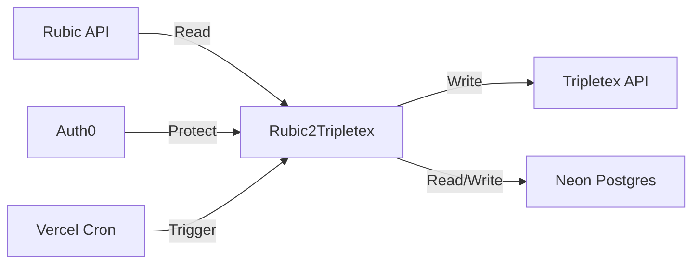
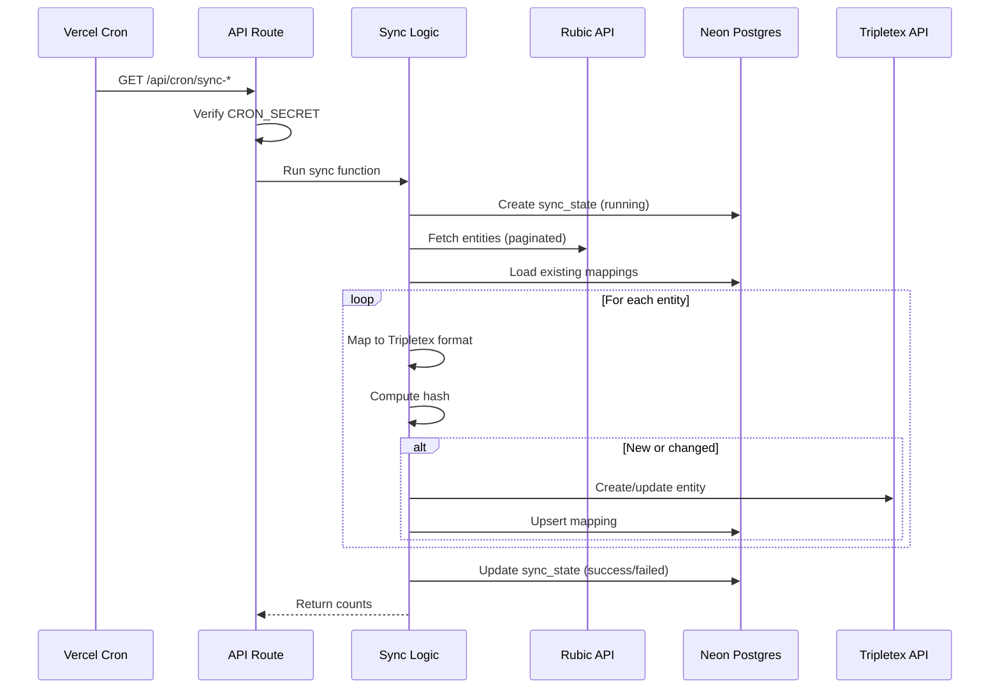

# Architecture

## System Overview

Rubic2Tripletex is a one-way data synchronization service that transfers membership and financial data from **Rubic** (membership management system) to **Tripletex** (ERP/accounting system). It runs as a Next.js application hosted on Vercel.

## Data Flow

The application syncs four entity types, each following a similar pattern:

1. **Fetch** data from the Rubic API (paginated)
2. **Map** Rubic entities to Tripletex format
3. **Compare** against stored hashes/mappings in the database to detect changes
4. **Create or update** entities in Tripletex
5. **Record** the mapping and sync status in the database

## Sync Types and Schedules

| Sync Type  | Schedule   | Change Detection   | Description                                         |
| ---------- | ---------- | ------------------ | --------------------------------------------------- |
| Customers  | Every 6h   | SHA-256 hash       | Create/update customers in Tripletex                |
| Products   | Every 6h   | SHA-256 hash       | Create/update products in Tripletex                 |
| Invoices   | Every 2h   | Mapping existence  | Create orders then invoices in Tripletex            |
| Payments   | Every 1h   | `paymentSynced` flag | Register payment transactions on invoices          |

## Database Schema

The application uses Neon Postgres with Drizzle ORM. Four tables track sync state and entity mappings:

### sync_state

Tracks each sync run with its status, timing, and record counts.

| Column            | Type        | Description                        |
| ----------------- | ----------- | ---------------------------------- |
| id                | serial PK   | Auto-incrementing ID               |
| sync_type         | enum        | customers, products, invoices, payments |
| status            | enum        | running, success, failed           |
| started_at        | timestamptz | When the sync started              |
| completed_at      | timestamptz | When the sync completed            |
| records_processed | integer     | Number of records successfully synced |
| records_failed    | integer     | Number of records that failed      |
| error_message     | text        | Error details if failed            |

### customer_mapping

| Column                | Type        | Description                        |
| --------------------- | ----------- | ---------------------------------- |
| rubic_customer_no     | varchar PK  | Rubic customer number              |
| tripletex_customer_id | integer     | Corresponding Tripletex customer ID |
| last_synced_at        | timestamptz | Last successful sync time          |
| hash                  | varchar(64) | SHA-256 hash for change detection  |

### product_mapping

| Column                | Type        | Description                        |
| --------------------- | ----------- | ---------------------------------- |
| rubic_product_code    | varchar PK  | Rubic product code                 |
| tripletex_product_id  | integer     | Corresponding Tripletex product ID |
| last_synced_at        | timestamptz | Last successful sync time          |
| hash                  | varchar(64) | SHA-256 hash for change detection  |

### invoice_mapping

| Column                 | Type        | Description                         |
| ---------------------- | ----------- | ----------------------------------- |
| rubic_invoice_id       | integer PK  | Rubic invoice ID                    |
| rubic_invoice_number   | integer     | Rubic invoice number                |
| tripletex_invoice_id   | integer     | Corresponding Tripletex invoice ID  |
| last_synced_at         | timestamptz | Last successful sync time           |
| payment_synced         | boolean     | Whether payment has been synced     |

## API Routes

| Route                             | Method | Auth         | Purpose                              |
| --------------------------------- | ------ | ------------ | ------------------------------------ |
| `/api/cron/sync-customers`        | GET    | CRON_SECRET  | Automated customer sync              |
| `/api/cron/sync-products`         | GET    | CRON_SECRET  | Automated product sync               |
| `/api/cron/sync-invoices`         | GET    | CRON_SECRET  | Automated invoice sync               |
| `/api/cron/sync-payments`         | GET    | CRON_SECRET  | Automated payment sync               |
| `/api/trigger/{syncType}`         | POST   | Auth0        | Manual sync trigger from dashboard   |
| `/api/health`                     | GET    | None         | Health check and sync status         |
| `/api/auth/login`                 | GET    | None         | Auth0 login redirect                 |
| `/api/auth/logout`                | GET    | Auth0        | Auth0 logout                         |

## Tech Stack

| Component         | Technology                          |
| ----------------- | ----------------------------------- |
| Framework         | Next.js (App Router)                |
| Language          | TypeScript (strict mode)            |
| Runtime           | Node.js 24                          |
| Package Manager   | Bun                                 |
| Database          | Neon Postgres (serverless)          |
| ORM               | Drizzle ORM                         |
| Auth              | Auth0 (`@auth0/nextjs-auth0` v4)    |
| Validation        | Zod                                 |
| Linting/Formatting| Biome.js                            |
| Hosting           | Vercel                              |
| Dev Environment   | DevContainer (Docker Compose)       |
