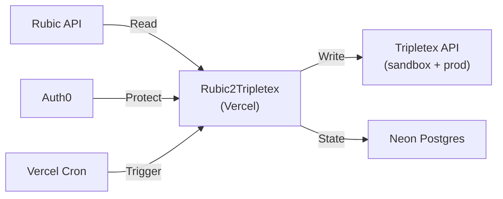

# Architecture

## Overview

Rubic2Tripletex is a one-way sync service: **Rubic → Tripletex**. It runs as a Next.js app on Vercel with Neon Postgres for state tracking.



## Sync Flow

Each sync type follows the same pattern:

1. Fetch entities from Rubic API (paginated)
2. Map to Tripletex format
3. Compare against stored hashes/mappings to detect changes
4. Create or update in Tripletex
5. Record mapping and sync state in database

Both sandbox and production Tripletex environments run independently with separate credentials, mappings, and sync state.

## API Routes

| Route | Method | Auth | Purpose |
| --------------------------------- | ------ | ----------- | -------------------------------- |
| `/api/cron/sync-{type}` | GET | CRON_SECRET | Automated sync (4 types) |
| `/api/trigger/{syncType}` | POST | Auth0 | Manual sync from dashboard |
| `/api/health` | GET | None | Health check and sync status |
| `/api/auth/login` | GET | None | Auth0 login |
| `/api/auth/logout` | GET | Auth0 | Auth0 logout |

## Database Schema

Four tables in Neon Postgres via Drizzle ORM:

- **sync_state** — Tracks each sync run (type, environment, status, timestamps, record counts, errors)
- **customer_mapping** — Maps Rubic `customerNo` → Tripletex `customerId` with SHA-256 hash, per environment
- **product_mapping** — Maps Rubic `productCode` → Tripletex `productId` with SHA-256 hash, per environment
- **invoice_mapping** — Maps Rubic `invoiceId` → Tripletex `invoiceId` with payment sync status, per environment

All mapping tables use composite primary keys of `(rubic_id, tripletex_env)`.

## Project Structure

```
app/                              # Next.js App Router
  api/
    auth/[...auth0]/route.ts      # Auth0 handlers
    cron/sync-{type}/route.ts     # Vercel cron endpoints (4 sync types)
    trigger/[syncType]/route.ts   # Manual trigger (auth-protected)
    health/route.ts               # Health check
  page.tsx                        # Dashboard (sync status + triggers)
src/
  clients/                        # Rubic + Tripletex API clients
  sync/                           # Sync orchestration (per entity type)
  mappers/                        # Rubic → Tripletex entity mapping
  db/                             # Drizzle schema, client, migrations
  types/                          # Rubic + Tripletex TypeScript types
  config.ts                       # Zod-validated environment config
  logger.ts                       # Structured logger (+ Sentry integration)
```

## Error Handling

- Each sync runs independently — one failure doesn't block others
- Failed individual records are logged but don't stop the batch
- `sync_state` tracks status per run for dashboard visibility
- Sentry captures exceptions and warnings automatically via the logger
- Structured JSON logging for Vercel's log viewer
